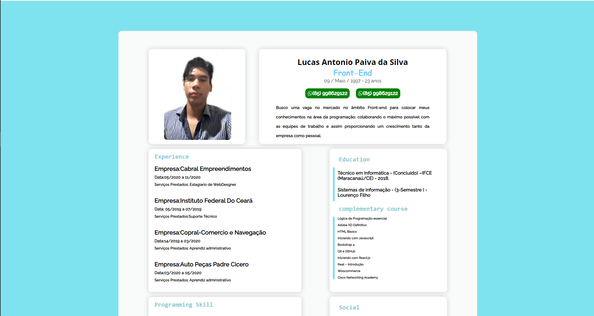

<h1 align="center">
  📑 Curriculum
</h1>

  

 

  
  
  
  

 

  <a href="README.md">English</a>
  ·
  <a href="README-pt.md">Português</a>

## 🚀 Technologies

### Front-end

- [ReactJS](https://pt-br.reactjs.org/)
- [React Icons](https://react-icons.github.io/react-icons/)
- [Devicon](https://devicons.github.io/devicon/)
- [Font Awesome](https://fontawesome.com/)
- [Styled Components](https://styled-components.com/)
- [Google Fonts](https://fonts.google.com/)
- [Eslint](https://eslint.org/)
- [Prettier](https://prettier.io/)
- [prop-types](https://www.npmjs.com/package/prop-types) - Runtime type checking for React props and similar objects

## 🎨 Design used as inspiration: [Dribbble](https://dribbble.com/shots/9111243-Simple-Layout-CV-Curriculum-Vitae-Design?utm_source=Clipboard_Shot&utm_campaign=rdfariz&utm_content=Simple%20Layout%20CV%20-%20Curriculum%20Vitae%20Design&utm_medium=Social_Share)

*Credits:* [Raden Fariz Insan Purnama](https://www.linkedin.com/in/rdfariz/)

## 🚀 Getting started

First of all you need to have `node` and `yarn`(or `npm`) installed on your machine.

*If you decide to use npm don't forget to delete `yarn.lock` in folders.*

Then you can clone the repository.

`git clone https://github.com/lcspaiva87/Curriculum`

Start the application

1. `cd frontend`
2. `yarn` or `npm install`
3. `yarn start` or `npm run start`

## 🤔 How to contribute

1. Fork the project;
2. Create your feature branch: `git checkout -b my-new-feature`;
3. Commit your changes: `git commit -m 'feat: Add some feature'`;
4. Push to the branch: `git push origin my-new-feature`;
5. Create a new Pull Request;
6. After the merge of your pull request is done, you can delete your branch.

## 📝 License

This project is under the MIT license. See the  [license](LICENSE) for more informations.

---

Made with 💟 by Lucas Antonio Paiva da Silva 👋 [Talk to me!](https://www.linkedin.com/in/lucas-antonio-paiva/)